<div align="center">

# signsight — Weather-Robust Traffic-Sign Recognition

**signsight is a traffic-sign classifier with an honest robustness benchmark. It takes sign images through these steps to a class, a robustness report and a latency report:**

`split by track` → `augment with weather` → `train` → `evaluate on corruption suites` → `detect and classify photos`.


**[Summary](#1-summary)** ·
**[Workflow](#4-the-end-to-end-workflow)** ·
**[Run it](#13-how-to-run-signsight)** ·
**[Configuration](#134-environment-variables)** ·
**[Known problems](#16-known-problems)** ·
**[Glossary](#18-glossary)**

</div>

> [!NOTE]
> This README uses ASD-STE100 Simplified Technical English. The writing rules and the project
> vocabulary are in [`docs/ste-style-guide.md`](docs/ste-style-guide.md). Each term in the
> [Glossary](#18-glossary) has only one meaning.

> [!WARNING]
> Do not use signsight in a vehicle or in any safety function. It is a research benchmark, not a certified perception system.

---

signsight measures how fog, rain, glare, snow, blur and night change a traffic-sign classifier, and how much weather augmentation helps.
The split keeps each track of frames in one part, so the score does not come from near-copies of training images.
Each model is evaluated on clean held-out images and on corrupted copies at 5 severities, over several seeds.
The optional condition input comes from the image itself, not from a live weather service.
A colour detector crops the sign from a full photo before the classifier, and the latency covers all stages.

This README is the **one location that explains all of signsight**. It gives these topics:

- the general design
- each component and its procedure, step by step
- the decision rules
- the data map
- the runbook
- the validation results and the known problems

| If you are… | Read |
|---|---|
| A manager or reviewer | [1](#1-summary), [3](#3-design-rules), [4](#4-the-end-to-end-workflow), [15](#15-validation-results), [17](#17-key-points) |
| A developer who joins the project | All sections, in sequence. Keep [13](#13-how-to-run-signsight) and [16](#16-known-problems) open while you work |
| An operator who runs signsight | [13](#13-how-to-run-signsight), then the section for the component that you use |

---

## Table of contents

1. 🧭 [Summary](#1-summary)
2. 🏗️ [How signsight is built](#2-how-signsight-is-built)
   - 2.1 [Components](#21-components)
   - 2.2 [System context](#22-system-context)
   - 2.3 [Repository layout](#23-repository-layout)
3. 🛡️ [Design rules](#3-design-rules)
4. 🔄 [The end-to-end workflow](#4-the-end-to-end-workflow)
   - 4.1 [Full flow](#41-full-flow)
   - 4.2 [The life cycle of one photo](#42-the-life-cycle-of-one-photo)
   - 4.3 [Who does which step](#43-who-does-which-step)
5. 📥 [Data and the track split](#5-data-and-the-track-split)
6. 🌫️ [Corruptions and augmentation](#6-corruptions-and-augmentation)
7. 🔵 [The HOG classifier](#7-the-hog-classifier)
8. 🟢 [The condition model](#8-the-condition-model)
9. 🟣 [The CNN classifier](#9-the-cnn-classifier)
10. ⚖️ [The robustness benchmark](#10-the-robustness-benchmark)
11. 📷 [Detection, prediction and latency](#11-detection-prediction-and-latency)
12. 🗂️ [Data and file map](#12-data-and-file-map)
13. ▶️ [How to run signsight](#13-how-to-run-signsight)
    - 13.1 [Prerequisites](#131-prerequisites) · 13.2 [Installation](#132-installation) · 13.3 [Run signsight](#133-run-signsight) · 13.4 [Environment variables](#134-environment-variables)
14. 🧩 [How to extend signsight](#14-how-to-extend-signsight)
15. ✅ [Validation results](#15-validation-results)
16. ⚠️ [Known problems](#16-known-problems)
17. 📌 [Key points](#17-key-points)
18. 📖 [Glossary](#18-glossary)
19. 📄 [License](#19-license)

---

## 1. Summary

**The problem.** A sign classifier can show a high test accuracy and still fail in fog or at night. These questions are difficult:

- Does the test accuracy come from new signs, or from frames of a sign that the model already saw?
- How much does each weather effect reduce the accuracy, and at which strength?
- Does weather augmentation help, also for effects that the training did not use?
- Can a condition input help, when it comes from the image and not from a weather service?
- How fast is the full pipeline from a photo file to a class?

signsight gives each of these questions its own component. Each component has a test.

| Item | Value |
|---|---|
| Input | GTSRB training and test files, synthetic signs, or a folder of photos |
| Output | `model.joblib`, `metrics.json`, `benchmark.json`, predictions, a latency report |
| Classifiers | `hog` (HOG + colour + logistic regression, default) and `cnn` (PyTorch, extra `torch`) |
| Corruptions | fog, rain, glare, snow, blur, night, each at severities 1 to 5 |
| Variants | `baseline`, `augmented`, `augmented_condition` |
| Offline mode | All commands with synthetic signs and synthetic scenes |
| Safety | No track is in train and validation. The test part never guides training |
| Tests | **25** unit tests (`pytest`), 1 more skips without PyTorch |

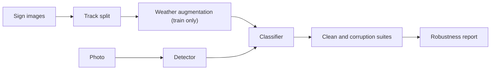

---

## 2. How signsight is built

### 2.1 Components

| Component | Module | Purpose |
|---|---|---|
| Settings | `src/signsight/config.py` | Environment variables and `.env` loader |
| Data | `src/signsight/data.py` | `ImageSet`, GTSRB reader (zip or folder), track split, image split for the leakage check |
| Synthetic data | `src/signsight/synthetic.py` | Signs in tracks, and street-like scenes |
| Corruptions | `src/signsight/corruptions.py` | Six seeded corruptions, the training augmentation |
| Features | `src/signsight/features.py` | HOG, colour histograms, condition cues |
| HOG classifier | `src/signsight/models/hog.py` | `HogClassifier` and `ConditionModel` |
| CNN classifier | `src/signsight/models/cnn.py` | `CnnClassifier` (extra `torch`) |
| Evaluation | `src/signsight/evaluate.py` | Clean metrics, corruption suites, mCE, ablation, leakage check |
| Detector | `src/signsight/detect.py` | Colour mask, largest area, box, IoU |
| Pipeline | `src/signsight/pipeline.py` | Prediction for files, latency for each stage |
| CLI | `src/signsight/cli.py` | The `signsight` command with 7 subcommands |

The component map shows which module calls which module. An arrow points from the caller to the module that it uses.

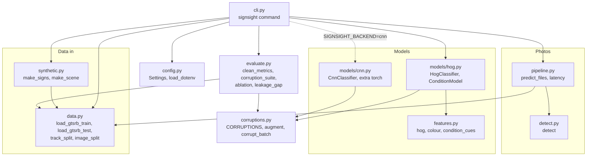

### 2.2 System context

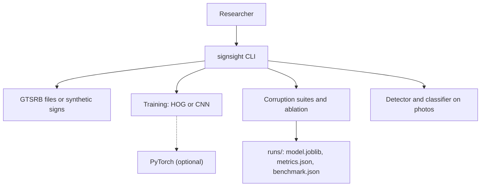

### 2.3 Repository layout

```
signsight/
├── .github/workflows/ci.yml     # CI: Python 3.11, pip install -e ".[dev]", pytest -q
├── .env.example                 # every environment variable, all values empty
├── pyproject.toml               # package, extras (torch, dev), signsight script
├── data/README.md               # synthetic signs, GTSRB files and terms, own photos
├── docs/ste-style-guide.md      # writing rules and project vocabulary
├── src/signsight/
│   ├── config.py  data.py  synthetic.py  corruptions.py  features.py
│   ├── models/                       # hog.py, cnn.py
│   ├── evaluate.py  detect.py  pipeline.py  cli.py
└── tests/                            # 26 tests (25 run without PyTorch), no network
```

---

## 3. Design rules

### 3.1 No track is in two parts
`track_split` uses `StratifiedGroupKFold` with the track ID as the group. A test checks that the parts share no track. `image_split` exists only to measure the leakage of a random split.

### 3.2 The test part never guides training
The CNN stops early on the validation part. With `--test-images` and `--test-gt`, the official GTSRB test set gives the final numbers, and nothing else uses it.

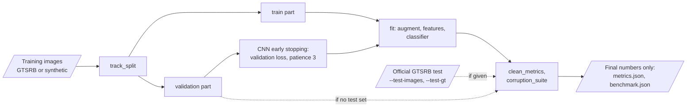

### 3.3 Robustness is measured, not assumed
Each model is evaluated on corrupted copies of the held-out images, for each corruption and severity. The augmentation uses only fog, rain and glare, so snow, blur and night measure the transfer to unseen effects.

### 3.4 The condition comes from the image
The prototype copied one live weather reading to each image. signsight drops that input. The `ConditionModel` predicts the condition of each image from global image cues, and the classifier gets these probabilities as features.

### 3.5 Rare classes are visible
The classifiers use class-balanced weights. The reports give macro-F1 and the 5 classes with the lowest recall, not only the accuracy.

### 3.6 A photo is cropped before classification
The classifier learns cropped signs. `predict_files` runs the detector on a full photo first, and gives `unknown` below the confidence limit.

### 3.7 All randomness has a seed, and no code asks for input
Data, corruptions, splits, models and the ablation use explicit seeds. Each command takes its paths as options. No code calls `input()`, and signsight needs no API key.

---

## 4. The end-to-end workflow

### 4.1 Full flow

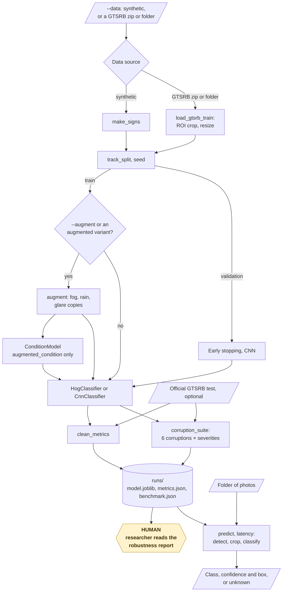

### 4.2 The life cycle of one photo

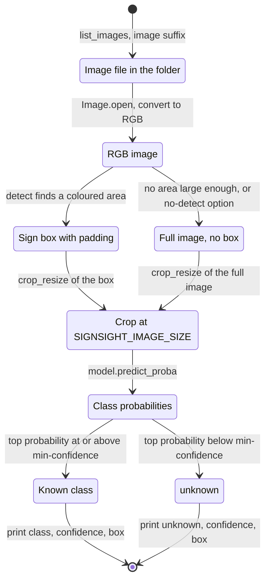

1. `list_images` finds the photo in the folder.
2. The pipeline reads the photo and converts it to RGB.
3. `detect` finds the largest area with sign colours and returns a box with 12 % padding.
4. `crop_resize` cuts the box and resizes it to `SIGNSIGHT_IMAGE_SIZE`.
5. The classifier gives the class probabilities.
6. If the top probability is below `--min-confidence`, the answer is `unknown`.
7. The CLI prints the class, the confidence and the box.

### 4.3 Who does which step

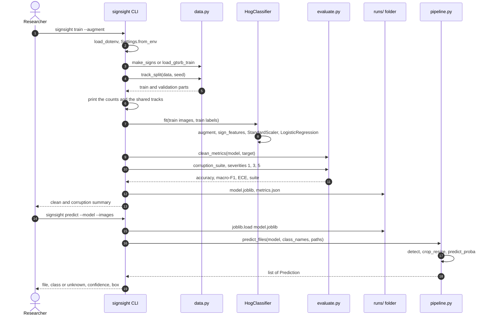

---

## 5. Data and the track split

**Purpose.** Load sign crops and split them so that no physical sign is in two parts.

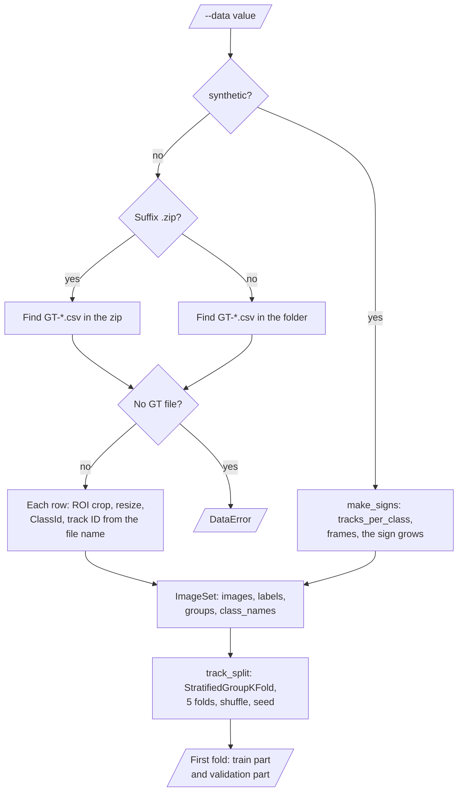

| Source | Reader | Track ID |
|---|---|---|
| GTSRB training zip or folder | `load_gtsrb_train` | `<class>-<track>` from the file name `<track>_<frame>.ppm` |
| GTSRB official test | `load_gtsrb_test` | One ID for each image |
| Synthetic signs | `make_signs(tracks_per_class, frames)` | `<class>-<track>` |

**Procedure**

1. Read the `GT-*.csv` rows of each class folder, in the zip or on disk.
2. Crop each image to its region of interest and resize it.
3. Split with `StratifiedGroupKFold` (5 folds for a validation share of 0.2) and keep the first fold as validation.

---

## 6. Corruptions and augmentation

**Purpose.** Make seeded weather and light effects for training copies and for the evaluation suites.

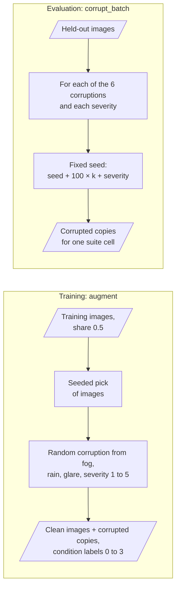

| Corruption | Effect | Used in augmentation |
|---|---|---|
| `fog` | Blend with grey haze, 20 % to 68 % | Yes |
| `rain` | Random streaks and a darker image | Yes |
| `glare` | Bright radial spot, 50 % to 100 % strength | Yes |
| `snow` | White flakes on 2 % to 14 % of pixels, lower contrast | No |
| `blur` | Gaussian blur, radius 0.5 to 2.0 px at 32 px | No |
| `night` | Brightness 70 % to 24 %, with sensor noise | No |

**Rules**

- Each corruption is a function of the image, the severity (1 to 5) and a seeded generator.
- `augment` adds corrupted COPIES of a share (default 50 %) of the training images, with a random corruption and severity. The clean images stay.
- The evaluation corrupts copies of the held-out images with a fixed seed for each corruption and severity.

---

## 7. The HOG classifier

**Purpose.** A fast, offline classifier that runs on a CPU.

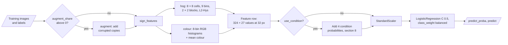

| Step | Value |
|---|---|
| Gradient features | HOG, 8 × 8 px cells, 9 direction bins, 2 × 2 blocks, L2-Hys |
| Colour features | 8-bin histogram of each RGB channel, plus the mean colour |
| Scaler | `StandardScaler`, fit on the training part |
| Classifier | `LogisticRegression(C=0.5, class_weight="balanced", max_iter=3000)` |

At 32 px, the HOG part has 324 values and the colour part has 27 values.

---

## 8. The condition model

**Purpose.** Give the classifier a condition input that changes with each image.

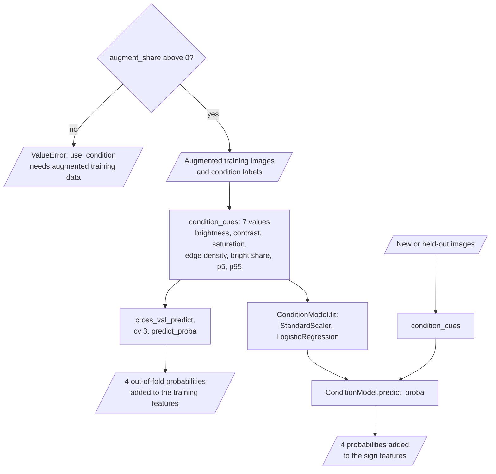

**Procedure**

1. Calculate 7 condition cues of each image: mean brightness, contrast, saturation, edge density, share of bright pixels, and the 5th and 95th brightness percentiles.
2. Fit a logistic regression that predicts the condition (clean, fog, rain, glare) of the augmented training images.
3. For the training rows, get the condition probabilities with 3-fold cross-validation.
4. Add the 4 probabilities to the sign features.
5. At prediction, use the fitted condition model for the probabilities.

---

## 9. The CNN classifier

**Purpose.** A small convolutional network for larger datasets (extra `torch`).

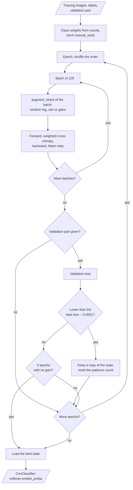

| Item | Value |
|---|---|
| Layers | 2 × (conv 32) → pool → 2 × (conv 64) → pool → conv 128 → global average pool → dropout 0.3 → linear |
| Loss | Cross-entropy with class weights |
| Optimizer | Adam, learning rate 0.002, batch 128 |
| Augmentation | With `--augment` or the `augmented` variant: on each training batch, 50 % of images get a random fog, rain or glare corruption. The `baseline` variant uses 0 % |
| Early stopping | Validation loss, patience 3, the best state is kept |
| Epochs | `SIGNSIGHT_EPOCHS` (default 15) |

---

## 10. The robustness benchmark

**Purpose.** Compare the variants over several seeds on clean and corrupted images.

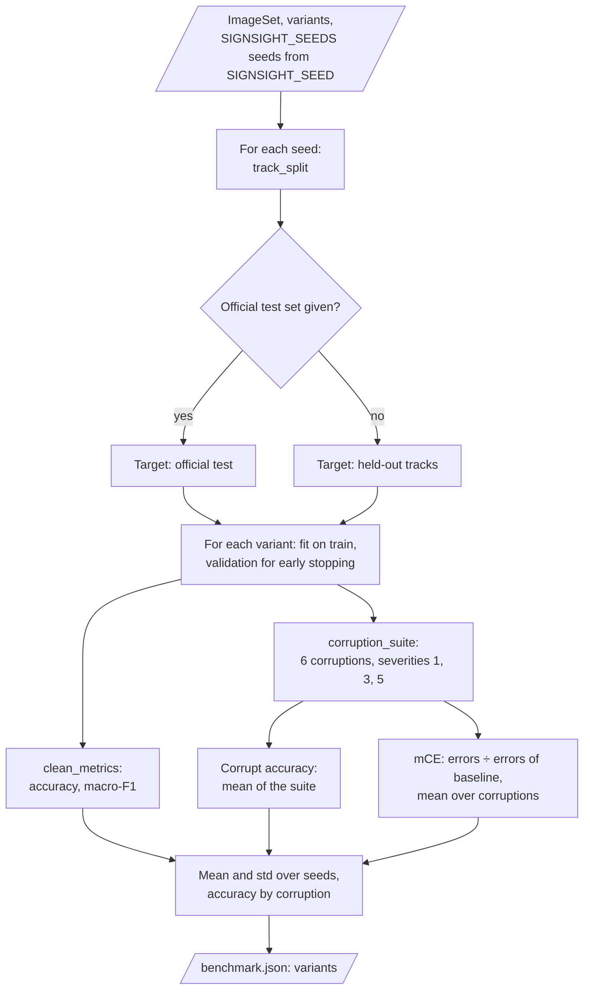

| Variant | Training data | Condition input |
|---|---|---|
| `baseline` | Clean training images | No |
| `augmented` | Clean images + fog, rain and glare copies | No |
| `augmented_condition` | Same as `augmented` | Yes (HOG only) |

| Metric | Meaning |
|---|---|
| Clean accuracy, macro-F1 | On the held-out tracks, or the official test set |
| Corrupt accuracy | Mean accuracy over 6 corruptions and severities 1, 3 and 5 |
| mCE | For each corruption, sum of errors over severities ÷ the same sum of `baseline`. Then the mean. Lower is better |
| ECE | Expected calibration error, 10 bins |
| Leakage gap | Accuracy with a random image split − accuracy with the track split |

Each value is the mean and the standard deviation over `SIGNSIGHT_SEEDS` seeds (default 3).

The leakage check trains the `baseline` variant two times on the same data:

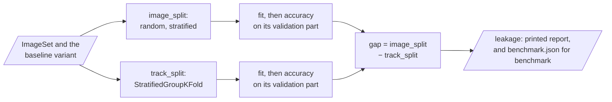

---

## 11. Detection, prediction and latency

**Purpose.** Classify full photos, and measure the time of the full pipeline.

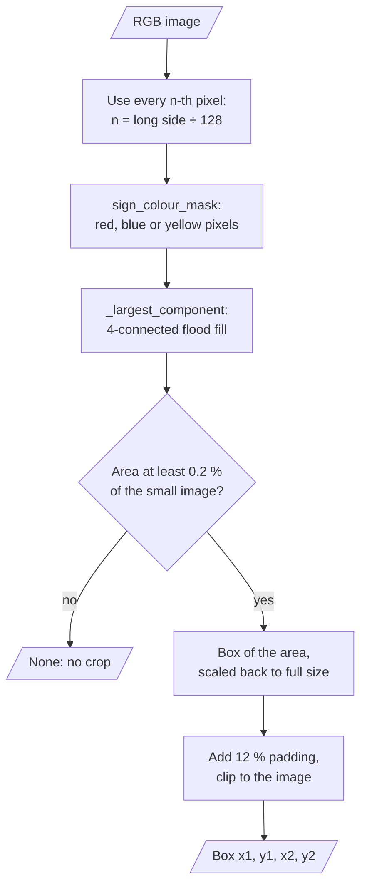

| Detector rule | Value |
|---|---|
| Red pixel | R > 110, R > 1.6 G, R > 1.6 B |
| Blue pixel | B > 100, B > 1.4 R, B > 1.15 G |
| Yellow pixel | R > 150, G > 110, B < 0.6 G |
| Work size | About 128 px on the long side |
| Minimum area | 0.2 % of the image |
| Padding | 12 % of the box on each side |

`latency` reads each file, detects, crops and classifies one image at a time after 3 warm-up images. It reports the median (p50) and the 95th percentile (p95) in milliseconds for each stage and for the total.

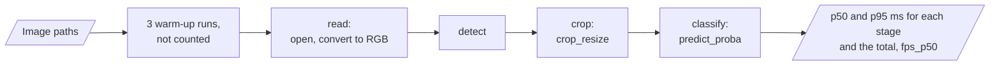

---

## 12. Data and file map

| Path | Committed? | Contents |
|---|---|---|
| `data/README.md` | Yes | Synthetic signs, GTSRB files and terms, own photos |
| `data/*` | No (git ignores it) | GTSRB zips, scenes, photos |
| `runs/model.joblib` | No (git ignores it) | The model, the class names and the image size |
| `runs/metrics.json` | No (git ignores it) | Clean metrics and the corruption suite of `train` |
| `runs/benchmark.json` | No (git ignores it) | The ablation and the leakage check |
| `.env` | No (git ignores it) | Local settings |
| `.env.example` | Yes | All variable names, no values |

---

## 13. How to run signsight

### 13.1 Prerequisites

| Need | For |
|---|---|
| Python 3.11+ | All components |
| `numpy`, `pillow`, `scikit-learn>=1.4` | Core (installed with the package) |
| `torch` (extra `torch`) | `SIGNSIGHT_BACKEND=cnn` |
| GTSRB files | Real results (optional) |

### 13.2 Installation

```bash
git clone https://github.com/KrishnaAnnavaram/signsight.git
cd signsight
python -m venv .venv
. .venv/bin/activate            # Windows: .venv\Scripts\activate
pip install -e ".[dev]"         # add ,torch for the CNN
```

### 13.3 Run signsight

Offline (no key, no network):

```bash
signsight demo                                        # ablation, leakage check, scene photos, latency
signsight train --augment --out runs                  # synthetic signs
signsight make-scenes --out data/scenes --n 20
signsight predict --model runs/model.joblib --images data/scenes
signsight latency --model runs/model.joblib --images data/scenes
signsight benchmark --out runs
```

With GTSRB:

```bash
signsight benchmark --data data/GTSRB_Final_Training_Images.zip \
    --test-images data/GTSRB/Final_Test/Images --test-gt data/GT-final_test.csv
SIGNSIGHT_BACKEND=cnn SIGNSIGHT_IMAGE_SIZE=48 signsight train --data data/GTSRB_Final_Training_Images.zip --augment
signsight evaluate --model runs/model.joblib --data data/GTSRB_Final_Training_Images.zip
```

| Command | What it does |
|---|---|
| `demo` | Runs the ablation, the leakage check, scene prediction with and without the detector, and latency |
| `train` | Trains one variant on the track split and saves the model and metrics |
| `evaluate` | Prints clean metrics and the full corruption suite (severities 1 to 5) of a saved model |
| `benchmark` | Runs the ablation over seeds and the leakage check, and writes `benchmark.json` |
| `predict` | Detects and classifies each image in a folder |
| `latency` | Measures the time of each pipeline stage |
| `make-scenes` | Writes synthetic street-like images with one sign each |

The diagram shows the order of the commands and the files that connect them.

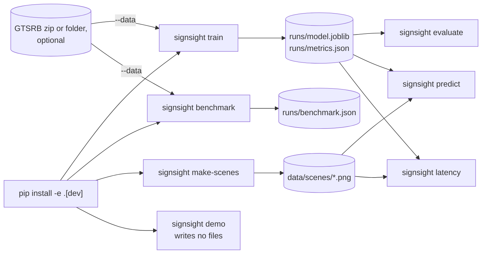

### 13.4 Environment variables

| Variable | Used by | Meaning |
|---|---|---|
| `SIGNSIGHT_DATA_DIR` | Settings | Data folder. Default `data`. No command reads this value. Give the paths with `--data` and `--images` |
| `SIGNSIGHT_OUT` | `train`, `benchmark` | Output folder. Default `runs` |
| `SIGNSIGHT_SEED` | All components | First seed. Default 42 |
| `SIGNSIGHT_IMAGE_SIZE` | Data, models | Crop size in pixels, a multiple of 8 and at least 16. Default 32 |
| `SIGNSIGHT_BACKEND` | `train`, `benchmark` | `hog` (default) or `cnn` |
| `SIGNSIGHT_EPOCHS` | CNN | Maximum epochs. Default 15 |
| `SIGNSIGHT_SEEDS` | `benchmark`, `demo` | Number of seeds. Default 3 |

The CLI reads a local `.env` file. A variable that is already in the environment wins. A value that is not valid stops the command with `error:`. signsight needs no credentials.

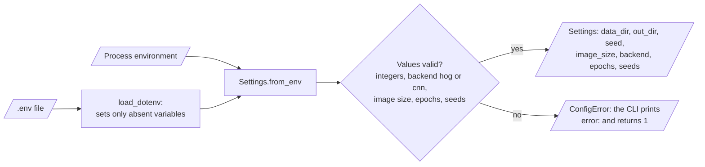

---

## 14. How to extend signsight

| You want to… | Do this | Code change? |
|---|---|---|
| Use larger crops | Set `SIGNSIGHT_IMAGE_SIZE=48` | No |
| Use the CNN | Install the extra `torch` and set `SIGNSIGHT_BACKEND=cnn` | No |
| Add a corruption | Write a function `(image, severity, rng)` and add it to `CORRUPTIONS` | Small |
| Use a pretrained backbone | Write a class with `fit`, `predict_proba`, `predict` and `classes_` | Yes |
| Use a trained detector | Replace `detect` with a function that returns a box | Yes |
| Export a model | Add an ONNX export for the CNN | Yes |

Planned milestones (not built):

- **M6:** GTSRB results with the official test set for the HOG and CNN variants, in this README.
- **M7:** a real adverse-weather sign set, to check the synthetic corruptions.
- **M8:** a trained detector and an ONNX export with latency on the target hardware.

---

## 15. Validation results

All numbers come from the **synthetic** signs (10 classes, 12 tracks of 10 frames for each class, 32 px, seeds 42 to 44). They are not GTSRB results.

| Validation | Result | Command |
|---|---|---|
| Unit tests (CI installs only `.[dev]`) | **25 passed**, 1 skipped (PyTorch absent) | `pytest -q` |
| Unit tests with PyTorch | **26 passed** | `pip install -e ".[dev,torch]"`, `pytest -q` |
| `baseline` | clean accuracy 0.947 ± 0.034, corrupt accuracy 0.413 ± 0.011, mCE 1.000 | `signsight demo` |
| `augmented` | clean accuracy 0.928 ± 0.032, corrupt accuracy 0.600 ± 0.024, mCE 0.685 ± 0.027 | `signsight demo` |
| `augmented_condition` | clean accuracy 0.926 ± 0.022, corrupt accuracy 0.597 ± 0.021, mCE 0.688 ± 0.024 | `signsight demo` |
| Severity 3, `baseline` → `augmented` | fog 0.33 → 0.76, rain 0.36 → 0.68, glare 0.40 → 0.57, snow 0.18 → 0.40, blur 0.59 → 0.73, night 0.10 → 0.49 | `signsight demo` |
| Leakage check | image split 1.000, track split 0.963, gap +0.037 | `signsight demo` |
| 20 scene photos | accuracy 0.80 with the detector, 0.10 without it | `signsight demo` |
| Latency, HOG, one image | p50 17.0 ms, p95 20.3 ms (read + detect + crop + classify, CPU) | `signsight demo` |

Augmentation with fog, rain and glare improves the accuracy on all six corruptions, also on snow, blur and night, which it did not use.
It costs about 2 points of clean accuracy.
The condition input gives no measurable gain here: the difference is smaller than one standard deviation.
The detector is necessary for full photos. Without it, the accuracy falls to chance level.
The prototype reported a high accuracy on a random image split (prototype result, not reproduced here). The leakage check shows why such a split gives too high a score.

---

## 16. Known problems

Read these problems before you use signsight in production.

| # | Area | Problem | Impact and action |
|---|---|---|---|
| 1 | Data | CI and the demo use only synthetic signs. GTSRB results are not reproduced in CI | Run `signsight benchmark` with the GTSRB files and the official test set (M6) |
| 2 | Corruptions | The corruptions are simple image effects, not real weather | Check the results on a real adverse-weather set (M7) |
| 3 | Condition input | The condition model knows only clean, fog, rain and glare | A gain on real weather is not shown. Keep the `augmented` variant as the default |
| 4 | Detector | The colour detector finds the largest coloured area. Red cars, blue sky parts or two signs confuse it | Use a trained detector for real photos (M8) |
| 5 | Domain | GTSRB shows German signs from one camera type. Other countries and cameras are a different domain | Check the `unknown` rate and the confidence on your photos |
| 6 | HOG model | HOG at 32 px loses fine details, for example the digits of speed limits | Use the CNN at 48 px for GTSRB |
| 7 | Latency | The latency is for one CPU, one image at a time, HOG model | Measure again on the target hardware with the final model |
| 8 | Safety | No result here supports use in a vehicle | Use signsight only for research |

---

## 17. Key points

1. **No track is in two parts.** The track split removes the leakage of near-copies.
2. **Robustness is measured on 6 corruptions at 5 severities.** Over seeds, with mCE against the baseline.
3. **Augmentation helps, also on unseen effects.** Corrupt accuracy rises from 0.413 to 0.600 on the synthetic benchmark.
4. **The condition comes from the image.** No constant weather reading, and no API key.
5. **Photos are cropped before classification.** The detector and the latency cover the full pipeline.
6. **The full benchmark runs offline.** All 25 core tests run with no network.

---

## 18. Glossary

| Term | Meaning |
|---|---|
| **Augmentation** | Corrupted copies of training images that are added to the training data |
| **Condition** | The predicted imaging condition of an image: clean, fog, rain or glare |
| **Corruption** | A synthetic weather or light effect on an image |
| **Corruption suite** | Corrupted copies of the held-out images for each corruption and severity |
| **Crop** | The image part inside the region of interest or the detector box |
| **ECE** | Expected calibration error |
| **HOG** | Histogram of oriented gradients |
| **Latency** | Milliseconds for one image, from file read to class |
| **mCE** | Errors over severities divided by the errors of the baseline, mean over corruptions |
| **Severity** | The strength of a corruption, 1 to 5 |
| **Track** | All frames of one physical sign |
| **Variant** | One model setting of the ablation |

---

## 19. License

[MIT](LICENSE) © 2026 Krishna Annavaram
